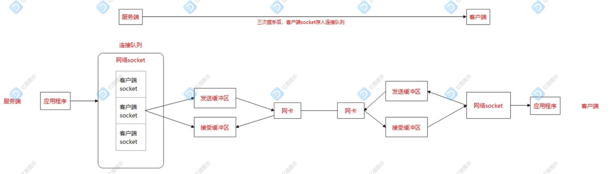

# theory

方法论与底层原理

## 001 方法论：如何正确精读Java源码

1. 一个springboot.jar包\META-INF\MANIFEST.MF下  
   所有的springboot工程的jar包的启动类: org.springframework.boot.loader.JarLauncher
2. 通过jdk自带的jdb进行在linux环境下debug,阅读源码

## 002 方法论：如何正确精读C源码

1. 通过gdb进行在linux环境下debug,阅读源码

## 003-1 方法论：如何正确粗读Java源码

1. 使用maxwell动态查看数据库更新数据

## 003-2 基础-网络-底层-TCPIP协议

1. 通过 tcpdump -s 0 -i 网卡名 tcp port 80 -w 80.pcap抓包后Wireshark工具打开，通过抓包方式 三次握手，交互，四场挥手
2. 了解内核发送缓冲区、内核接受缓冲区，可读可写本质
   

## 004 基础-网络-应用层-NIO框架
1. 一个网络框架在逻辑上要解决哪几个问题？
   - server socket的绑定（bind ip,port）+ 启动监听动作 (这是为了让client可以连上来)
   - 连接上来的socket，启动IO监听动作，按需进行IO读写操作
   - 针对读到的数据，执行业务逻辑操作，业务逻辑操作得到的数据，执行写操作，通过步骤2写回去
2. 获取socket过程
   
3. socket数据处理流程
>1.	应用层分发socket给IO线程组
>2.	IO线程组将此新socket纳入某个线程的监听 可读可写事件的socket集合(每个线程托管1部分socket)
>3.	对于某个线程来说，获得其监管下socket的可读/可写的socket子集，然后遍历子集的每一个socket
>4.	可读时，执行读操作，应用层长度完整后，抛给后面的业务线程池
>5.	业务逻辑处理结果再返回给之前的线程
>6.	IO线程监听可写事件，满足条件时，写(复制)到内核态发送缓冲区
>7.	剩下的交给内核的网络协议栈，想一下以前学的滑动窗口协议
>8.	不停循环  
>

4.各线程操作  

## 005 中间件-SpringBoot内的Tomcat

